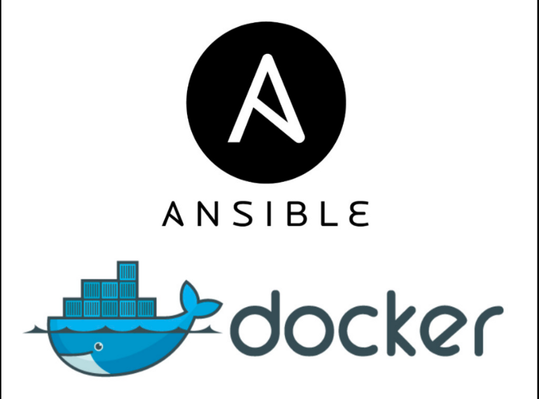

# Terraform-AWS-Jenkins-Anisble-Docker-project




## Using Jenkins to Deploy nodeJS app on EC2 instance and using terraform to build the infrastructure on AWS.

## Infrastructure
- 1) VPC
- 2) Internet Gateway (Connected to the VPC) 
- 3) NAT (Put on the public subnet to connect the private subnets to the internet)
- 4) 4 route tables (2 for bastion hosts) and (2 for private instances)
- 5) 2 SG ( 1 to allow SSH and port 3000) ,( 1 to allow SSH only)
- 6) 2 Bastion hosts(connected to the SG allowed SSH only) and 2 private EC2 (connected with the SG (allowed ssh and port 3000)
- 7) RDS 
- 8) ElastiCache
- 9) Application LoadBalancer
***
### Project has 2 environments :
- ### dev => which in US-EAST-1 Region
- ### prod => which in EU-Central-1 Region
***
### You need to authenticate your aws account to attach it with terraform by:
- use this command:
```
vim ~/.aws/credentials
```
- Add your account's (Access Key ID) and (Secret Key ID) to the file for example:
```
[default]
aws_access_key_id = <YOUR ACCESS KEY ID>
aws_secret_access_key = <YOUR SECRET KEY ID>

``` 
- now you are authenticated to your AWS account.

### To run the development environment type:
```bash
terraform destroy --var-file dev.tfvars 
```

### To run the production environment type:
```bash
terraform destroy --var-file prod.tfvars 
```
***
### To access the private instance directly from your local device >> we use Jump host
### Configurations for the jump host:

```bash
$ vim ~/.ssh/config
host bastion
   HostName 3.64.179.172
   User ubuntu
   identityFile ~/.ssh/my-keypair.pem

host private_instance
   HostName  10.0.3.106
   user  ubuntu
   ProxyCommand ssh bastion -W %h:%p
   identityFile ~/.ssh/my-keypair.pem                                        
```

### Now we need to create infrastructure to run Jenkins-agent on the private EC2
- 1) Using Ansible playbook to install (Docker ,  Open JDK , git)
- 2) Create Home Directory for Jenkins (jenkins_home)
- 3) in the inventory file using the name of the private instance you created on the config file 
### To run the playbook:
```bash
$ ansible-playbook myapp.yaml
```
### Now we create the basic configuration on the Private instance to create jenkins-agent on it
### to let the jenkins master running on local machine can run on the jenkins agent directly we need to make the same configuration for (.ssh/config) file on the jenkins container
```bash
$  docker exec -it (container-id) bash
 root@f5365ab02149:~/ vim .ssh/config
```

```bash
host bastion
   HostName 3.64.179.172
   User ubuntu
   identityFile ~/.ssh/my-keypair.pem

host private_instance
   HostName  10.0.3.106
   user  ubuntu
   ProxyCommand ssh bastion -W %h:%p
   identityFile ~/.ssh/my-keypair.pem         
```
### Check you can access the private instance through the jenkins container
```bash
root@f5365ab02149:~/.ssh# ssh private_instance
Welcome to Ubuntu 20.04.4 LTS (GNU/Linux 5.13.0-1031-aws x86_64)

 * Documentation:  https://help.ubuntu.com
 * Management:     https://landscape.canonical.com
 * Support:        https://ubuntu.com/advantage

  System information as of Sat Jul 30 17:53:42 UTC 2022

  System load:  0.0               Processes:                121
  Usage of /:   57.2% of 7.58GB   Users logged in:          0
  Memory usage: 42%               IPv4 address for docker0: 172.17.0.1
  Swap usage:   0%                IPv4 address for eth0:    10.0.3.106

 * Ubuntu Pro delivers the most comprehensive open source security and
   compliance features.

   https://ubuntu.com/aws/pro

3 updates can be applied immediately.
To see these additional updates run: apt list --upgradable


*** System restart required ***
Last login: Sat Jul 30 16:24:06 2022 from 10.0.1.44
ubuntu@ip-10-0-3-106:~$ 
```
***
### Create the jenkins-node
- 

- 

- 

### Create a pipeline  to pull the node app image from github line and run the container

```Jenkinsfile
pipeline{
    agent { label 'agent-slave' }
    stages {
        stage('preparation'){
            steps{
                git branch:"rds_redis", url:'https://github.com/mahmoud254/jenkins_nodejs_example'
            }
        }
        stage('ci'){
            steps{
                sh 'docker build . -f dockerfile -t node-app/iti_jenkins'
                }
            }
        stage('cd'){
            steps{
                withCredentials([usernamePassword(credentialsId: 'my-pass',usernameVariable:'USER', passwordVariable:'PASSWORD')]){
                sh '''docker run -d -p 3000:3000 \
                        -e RDS_HOSTNAME=test-lb-tf-499796348.eu-central-1.elb.amazonaws.com \
                        -e RDS_USERNAME=${USER}\
                        -e RDS_PASSWORD=${PASSWORD} \
                        -e RDS_PORT=3306 \
                        -e REDIS_HOSTNAME=cluster-example.59g3nf.0001.euc1.cache.amazonaws.com:6379 \
                        -e  REDIS_PORT=6379 \
                        node-app/iti_jenkins'''
            
                }
            }
        }
    }
}
```
### You can access the app on (loadbalancerDNS:3000)